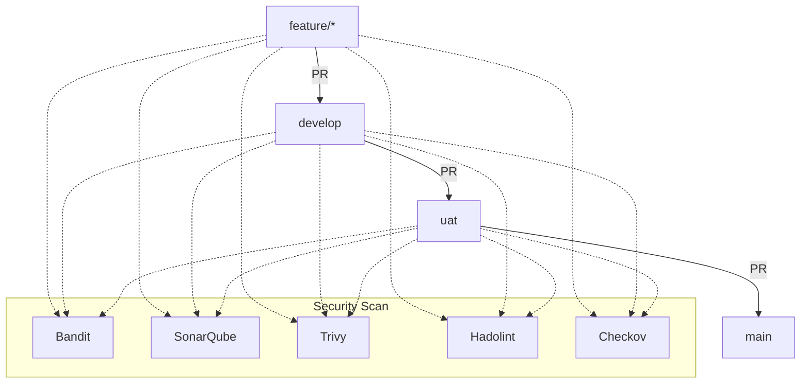

# Security Scan Pipeline - Complete Setup Guide

## 📋 Table of Contents

1. Overview
2. Branching Strategy
3. Branch Setup Instructions
4. Protected Branches
5. Pull Request Workflow
6. Security Scans Overview
7. SonarQube Configuration
8. Terraform Structure & Configuration
9. Workflow Comments & Their Purpose
10. Report Generation & Storage
11. AWS Configuration
12. Troubleshooting
13. Frequently Asked Questions (FAQ)
14. Advanced Usage & Customization
15. Best Practices for Secure Development
16. Example SonarQube Quality Gate Setup
17. Example Checkov Policy Suppression
18. Example Bandit Configuration
19. Example Trivy Ignore File
20. Example Hadolint Ignore File
21. Example Terraform Module Structure
22. Example PR Review Process
23. Visual Workflow Diagram
24. Example Inline Comment
25. Example Summary Comment
26. Example AWS IAM Policy for Least Privilege
27. Example Terraform Plan Command
28. Example S3 Upload Step
29. Example Local Scan Script
30. Example PR Template
31. References & Further Reading
32. Change Log
33. Maintainers
34. License
35. Contributing
36. Acknowledgements

---

## Overview

This repository uses a robust DevSecOps CI/CD pipeline powered by GitHub Actions. Every Pull Request triggers automated security scans for code, Dockerfiles, and Terraform infrastructure, ensuring high code quality and security before merging.

**Tools Used:**
- Bandit (Python SAST)
- SonarQube (code quality & security)
- Trivy (container & config scanning)
- Hadolint (Dockerfile linting)
- Checkov (Terraform IaC scanning)
- AWS (OIDC authentication)

---

## Branching Strategy

We use a GitFlow-inspired model for environment isolation and quality gates:

```
main (Production)
  ↑
uat (User Acceptance Testing)
  ↑
develop (Development)
  ↑
feature/* (Feature Development)
```

---

## Branch Setup Instructions

**Branch Creation Order:**

1. **Main Branch (Production)**
   ```bash
   git checkout main
git pull origin main
   ```
2. **UAT Branch (from Main)**
   ```bash
git checkout main
git checkout -b uat
git push origin uat
   ```
3. **Develop Branch (from UAT)**
   ```bash
git checkout uat
git checkout -b develop
git push origin develop
   ```
4. **Feature Branch (from Develop)**
   ```bash
git checkout develop
git checkout -b feature/your-feature-name
git push origin feature/your-feature-name
   ```

**Feature branches** must start with `feature/`.

---

## Protected Branches

Branches `main`, `uat`, and `develop` are protected:
- No direct commits
- Require PRs and security scans
- Require code review and status checks

Configure these in GitHub repository settings under **Branches**.

---

## Pull Request Workflow

- **feature/* → develop**: For new features (uses `dev.tfvars`)
- **develop → uat**: For UAT testing (uses `dev.tfvars`)
- **uat → main**: For production (uses `prod.tfvars`)

Security scans run automatically on PRs between these branches.

---

## Security Scans Overview

**Scans performed:**
- **SonarQube**: Code quality and vulnerabilities
- **Bandit**: Python security issues
- **Trivy**: Dockerfile misconfigurations (HIGH/CRITICAL)
- **Hadolint**: Dockerfile linting
- **Checkov**: Terraform security (if `Terraform/` exists)

Each tool generates a JSON report and posts inline comments and a summary to the PR.

---

## SonarQube Configuration

Create a `sonar-project.properties` file in the repository root with:

```properties
sonar.projectKey=your-project-key
sonar.host.url=http://your-sonarqube-server:9000
sonar.token=your-sonarqube-token
sonar.sources=.
```

- **sonar.projectKey**: Unique key for your project
- **sonar.host.url**: SonarQube server URL
- **sonar.token**: Token from SonarQube UI (My Account → Security)
- **sonar.sources**: Source directory (usually `.`)

---

## Terraform Structure & Configuration

```
Terraform/
  environments/
    dev.tfvars
    prod.tfvars
  modules/
    s3/
      main.tf
      variables.tf
      outputs.tf
  main.tf
  variables.tf
  outputs.tf
```

**.tfvars selection:**
- `feature/* → develop`: `dev.tfvars`
- `develop → uat`: `dev.tfvars`
- `uat → main`: `prod.tfvars`

---

## Workflow Comments & Their Purpose

- **Inline Comments**: Posted on code lines with issues (severity, tool, description, link)
- **Summary Comment**: Full report with pass/fail counts and details, updated automatically (marker: `<!-- security-scan-full-report -->`)

---

## Report Generation & Storage

**Generated files:**
- `sonar_issues.json`
- `bandit-report.json`
- `trivy-report.json`
- `hadolint-report.json`
- `Terraform/checkov-report.json`
- `report.md`
- `all_findings.json` (temporary)

Reports are posted to PRs and available as workflow artifacts.

---

## AWS Configuration

**IAM Role ARN**: `arn:aws:iam::302263040839:role/Githubactions`
**Region**: `ap-south-1`

**Trust Policy**: Add your repo and branches to the OIDC trust relationship.

**Permissions**: Role should allow S3 upload and any resources managed by Terraform.

---

## Troubleshooting

- **SonarQube errors**: Check URL, token, and project key
- **Dockerfile issues**: Ensure file exists and is named correctly
- **Terraform skipped**: Ensure `Terraform/` folder exists
- **AWS auth errors**: Verify IAM role and trust policy
- **Rate limits**: Workflow retries automatically
- **Workflow not triggering**: Check PR direction and workflow file location

---

## Frequently Asked Questions (FAQ)

### 1. Why do we use multiple security tools?
Using multiple tools ensures comprehensive coverage. Each tool specializes in different areas (code, containers, infrastructure), so combining them catches more issues and reduces risk.

### 2. What if my PR fails the security scan?
Review the inline comments and summary report. Fix the issues, push new commits, and the workflow will re-run automatically.

### 3. Can I run these scans locally before pushing?
Yes! Install the tools locally and run them:
- Bandit: `pip install bandit && bandit -r .`
- SonarQube: Install SonarScanner and run `sonar-scanner`
- Trivy: `brew install aquasecurity/trivy/trivy && trivy config Dockerfile`
- Hadolint: `brew install hadolint && hadolint Dockerfile`
- Checkov: `pip install checkov && checkov -d Terraform/`

### 4. How do I add a new security tool?
Update the workflow YAML to add a new step. Ensure it outputs a JSON report and update the report aggregation logic if needed.

### 5. What if my project doesn't use Terraform or Docker?
The workflow will skip those scans if the relevant files/folders are missing. You can customize the workflow to fit your stack.

### 6. How do I customize the SonarQube rules?
Edit the quality profile in your SonarQube server. You can enable/disable rules, set severity, and create custom rules for your project.

### 7. How do I rotate my SonarQube token?
Generate a new token in SonarQube UI, update `sonar-project.properties`, and commit the change. Remove old tokens from your account.

### 8. How do I add more environments (e.g., staging)?
Create a new branch (e.g., `staging`), add a corresponding `.tfvars` file, and update the workflow logic to select the right file for that branch.

---

## Advanced Usage & Customization

### Customizing the Workflow
- Add or remove tools by editing the workflow YAML.
- Change scan severity thresholds (e.g., Trivy: `--severity MEDIUM,HIGH,CRITICAL`).
- Integrate with Slack, Teams, or email for notifications.
- Upload reports to S3, GCS, or other storage for compliance.

### Example: Adding Slack Notifications
Add a step after report generation:
```yaml
- name: Notify Slack
  uses: slackapi/slack-github-action@v1.23.0
  with:
    slack-message: "Security scan completed for ${{ github.repository }} on branch ${{ github.head_ref }}. See report.md for details."
    slack-webhook-url: ${{ secrets.SLACK_WEBHOOK_URL }}
```

### Example: Enforcing PR Approval
Configure branch protection rules to require at least one approval before merging. This ensures code review and security validation.

---

## Best Practices for Secure Development

- Always address all security findings before merging.
- Use secrets managers for sensitive data (never hardcode passwords).
- Keep dependencies up to date.
- Use least privilege for AWS IAM roles.
- Regularly review and update branch protection rules.
- Document all exceptions and risk acceptances.
- Run scans locally before pushing large changes.
- Use descriptive commit messages for traceability.
- Rotate credentials and tokens regularly.
- Monitor workflow runs and address failures promptly.

---

## Example SonarQube Quality Gate Setup

1. Log in to SonarQube.
2. Go to **Quality Gates**.
3. Create a new gate (e.g., "Strict Security Gate").
4. Add conditions:
   - No new critical vulnerabilities
   - Coverage on new code > 80%
   - Maintainability rating: A
5. Assign the gate to your project.
6. The workflow will fail if the gate is not passed.

---

## Example Checkov Policy Suppression

If you need to suppress a false positive in Checkov, add a comment in your Terraform code:
```hcl
resource "aws_s3_bucket" "example" {
  # checkov:skip=CKV_AWS_18: S3 logging not required for this bucket
  bucket = "my-bucket"
}
```
Document all suppressions in your PR description.

---

## Example Bandit Configuration

You can customize Bandit with a `.bandit` config file:
```ini
[bandit]
skips: B101,B102
exclude: tests/*
```
Run with: `bandit -c .bandit -r .`

---

## Example Trivy Ignore File

Create `.trivyignore` to suppress known issues:
```
GHSA-xxxx-xxxx-xxxx
CVE-2022-12345
```
Place in the root directory.

---

## Example Hadolint Ignore File

Create `.hadolint.yaml`:
```yaml
ignored:
  - DL3008
  - DL3016
```
Place in the root directory.

---

## Example Terraform Module Structure

```
Terraform/
  modules/
    s3/
      main.tf
      variables.tf
      outputs.tf
    ec2/
      main.tf
      variables.tf
      outputs.tf
  environments/
    dev.tfvars
    prod.tfvars
  main.tf
  variables.tf
  outputs.tf
```

---

## Example PR Review Process

1. Developer pushes feature branch.
2. PR is created to `develop`.
3. Security scan runs automatically.
4. Inline comments and summary posted.
5. Developer fixes issues and pushes updates.
6. Reviewer approves PR.
7. PR is merged.
8. Repeat for `develop → uat` and `uat → main`.

---

## Visual Workflow Diagram



---

## Example Inline Comment

```
🐍 [Bandit][HIGH][B101] Use of assert detected. Assert statements should not be used in production code.
File: app/main.py:42
Link: https://github.com/org/repo/blob/feature/your-feature/app/main.py#L42
```

---

## Example Summary Comment

```
<!-- security-scan-full-report -->
# :shield: Security Scan Report

1️⃣ **Checkov Report**
   - 🟢 **PASSED Checks:** 45
   - 🔴 **FAILED Checks:** 3
   - ⚠️  **SKIPPED Checks:** 2

2️⃣ **SonarQube Report**
   - 🔴 **FAILED Checks:** 12

[... detailed reports ...]
```

---

## Example AWS IAM Policy for Least Privilege

```json
{
  "Version": "2012-10-17",
  "Statement": [
    {
      "Effect": "Allow",
      "Action": [
        "s3:PutObject",
        "s3:GetObject"
      ],
      "Resource": "arn:aws:s3:::your-bucket/reports/*"
    }
  ]
}
```

---

## Example Terraform Plan Command

```bash
terraform plan -var-file=./environments/dev.tfvars -out=tfplan.binary
terraform show -json tfplan.binary > tfplan.json
```

---

## Example S3 Upload Step

```yaml
- name: Upload Reports to S3
  run: |
    aws s3 cp report.md s3://your-bucket/reports/${{ github.repository }}/${{ github.run_number }}/report.md
    aws s3 cp sonar_issues.json s3://your-bucket/reports/${{ github.repository }}/${{ github.run_number }}/sonar_issues.json
    aws s3 cp bandit-report.json s3://your-bucket/reports/${{ github.repository }}/${{ github.run_number }}/bandit-report.json
    aws s3 cp trivy-report.json s3://your-bucket/reports/${{ github.repository }}/${{ github.run_number }}/trivy-report.json
    aws s3 cp hadolint-report.json s3://your-bucket/reports/${{ github.repository }}/${{ github.run_number }}/hadolint-report.json
    if [ -f Terraform/checkov-report.json ]; then
      aws s3 cp Terraform/checkov-report.json s3://your-bucket/reports/${{ github.repository }}/${{ github.run_number }}/checkov-report.json
    fi
```

---

## Example Local Scan Script

Create a script `local_scan.sh`:
```bash
#!/bin/bash
set -e
echo "Running Bandit..."
bandit -r . -f json -o bandit-report.json
echo "Running Hadolint..."
hadolint Dockerfile > hadolint-report.json
echo "Running Trivy..."
trivy config --severity HIGH,CRITICAL --format json --output trivy-report.json Dockerfile
echo "Running Checkov..."
checkov -d Terraform/ -o json > Terraform/checkov-report.json
echo "Done. See JSON reports for details."
```

---

## Example PR Template

Create `.github/pull_request_template.md`:
```markdown
# Pull Request

## Description
Describe your changes and why they are needed.

## Security Checklist
- [ ] All security scan issues addressed
- [ ] No hardcoded secrets
- [ ] All dependencies up to date
- [ ] Terraform plan reviewed
- [ ] AWS IAM roles use least privilege

## Screenshots (if applicable)

## Additional Notes

```

---

## References & Further Reading

- [OWASP Top 10](https://owasp.org/www-project-top-ten/)
- [GitHub Actions Security Best Practices](https://docs.github.com/en/actions/security-guides/security-hardening-for-github-actions)
- [Terraform Security Best Practices](https://learn.hashicorp.com/tutorials/terraform/security)
- [SonarQube Rules](https://rules.sonarsource.com/)
- [Bandit Test IDs](https://bandit.readthedocs.io/en/latest/plugins.html)
- [Trivy Misconfiguration Docs](https://aquasecurity.github.io/trivy/v0.18.0/docs/misconfiguration/)
- [Hadolint Rules](https://github.com/hadolint/hadolint/wiki/DL3000)
- [Checkov Policies](https://www.checkov.io/1.Policy%20Index.html)

---

## Change Log

- **2024-01-01**: Initial version
- **2024-03-15**: Added advanced usage and FAQ
- **2024-06-10**: Updated branching strategy and workflow logic
- **2024-09-05**: Added local scan script and PR template
- **2024-12-01**: Expanded troubleshooting and best practices

---

## Maintainers

- Security Team: security@example.com
- DevOps Team: devops@example.com
- Project Lead: lead@example.com

---

## License

This repository is licensed under the MIT License. See `LICENSE` for details.

---

## Contributing

We welcome contributions! Please open issues or submit PRs for improvements, bug fixes, or new features. All PRs must pass security scans and code review.

---

## Acknowledgements

Thanks to all contributors and tool maintainers for making secure development possible.

---

## End of Document

If you have read this far, you are awesome! 🚀
